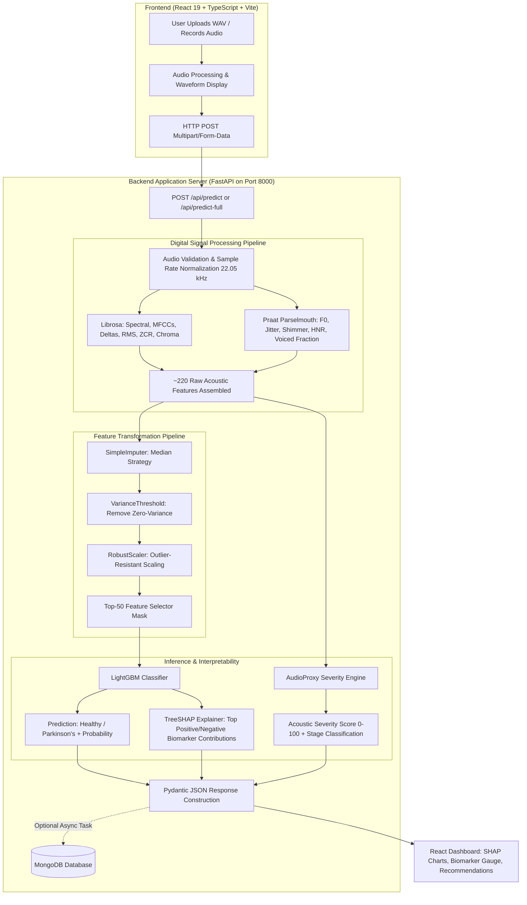

<div align="center">

# ParkinsonXAI
### A Patient-Independent and Explainable Voice-Based Machine Learning Framework for Parkinson’s Disease Detection and Severity Estimation

**PROJECT 01** &nbsp;|&nbsp; **Academic Year 2025–2026**  
**Institution:** Kalasalingam Academy of Research and Education (KARE)

[](https://www.python.org/)
[](https://fastapi.tiangolo.com/)
[](https://react.dev/)
[](https://www.typescriptlang.org/)
[](https://lightgbm.readthedocs.io/)
[](https://shap.readthedocs.io/)
[](#)

</div>

---

> [!CAUTION]
> ### IMPORTANT SCIENTIFIC EVALUATION & GENERALIZATION NOTE
> To maintain strict academic rigor and transparency during reviews, students and reviewers must distinguish between the evaluation contexts across datasets:
> 1. **Deployed Detection Model (Dataset 1):** The deployed classifier (`models/detection_best_model.pkl`) was trained on features extracted from Dataset 1 (1,134 WAV files). Because Dataset 1 filenames (`healthy_001.wav`, `parkinsons_001.wav`) do not contain verified speaker/patient identifiers, the **96.49% accuracy / 0.9995 ROC-AUC result is a record-level (file-level) metric only** and **cannot establish patient-independent performance**.
> 2. **Patient-Independent Benchmark (Dataset 2):** Genuine patient-independent evaluation is established on Dataset 2 (756 recordings from 252 subjects, 3 recordings/subject with verified subject IDs) using `GroupShuffleSplit`. In audited research experiments, the tuned LightGBM model achieved **90.35% accuracy, 96.30% recall, 93.41% F1-score, and 0.9645 ROC-AUC** across unseen test subjects.
> 3. **Non-Clinical Device Status:** Neither result constitutes clinical diagnostic validation. ParkinsonXAI is an engineering research prototype designed for computational exploration and decision-support study.

---

> [!IMPORTANT]
> **STUDENT HANDOVER NOTICE & MANDATORY FIRST STEP (GIT LFS)**  
> This repository uses **Git Large File Storage (Git LFS)** to track dataset archives (`.zip`) and binary machine learning artifacts (`.pkl`). If you clone this repository without Git LFS, the model files will be tiny text pointer files (~130 bytes), and the backend will fail to load models on startup.  
> **Mandatory Command:** Run `git lfs install && git lfs pull` immediately after cloning.

---

## Table of Contents

1. [Executive Summary & Project Overview](#1-executive-summary--project-overview)
2. [Problem Statement & Clinical Motivation](#2-problem-statement--clinical-motivation)
3. [Core Objectives](#3-core-objectives)
4. [What's Inside This Project?](#4-whats-inside-this-project)
5. [System Architecture](#5-system-architecture)
6. [Technology Stack & Verified Dependencies](#6-technology-stack--verified-dependencies)
7. [Repository Structure](#7-repository-structure)
8. [Dataset Architecture & Scientific Audit](#8-dataset-architecture--scientific-audit)
9. [Acoustic Feature Engineering](#9-acoustic-feature-engineering)
10. [Machine Learning Pipeline](#10-machine-learning-pipeline)
11. [Detection Model (Classification)](#11-detection-model-classification)
12. [Severity Estimation (UPDRS vs. AudioProxy)](#12-severity-estimation-updrs-vs-audioproxy)
13. [Explainable AI (SHAP Interpretability)](#13-explainable-ai-shap-interpretability)
14. [Patient-Independent Evaluation & Leakage Prevention](#14-patient-independent-evaluation--leakage-prevention)
15. [Empirical Model Performance & Benchmark Results](#15-empirical-model-performance--benchmark-results)
16. [Frontend User Interface & Pages](#16-frontend-user-interface--pages)
17. [Backend REST API Reference](#17-backend-rest-api-reference)
18. [System Prerequisites & Environment Requirements](#18-system-prerequisites--environment-requirements)
19. [Step-by-Step Installation Guide (Windows & Linux)](#19-step-by-step-installation-guide-windows--linux)
20. [Environment Configuration (`.env`)](#20-environment-configuration-env)
21. [Running the Backend Service](#21-running-the-backend-service)
22. [Running the Frontend Application](#22-running-the-frontend-application)
23. [Quick Start Summary](#23-quick-start-summary)
24. [How to Verify the Project Is Actually Working (Step-by-Step)](#24-how-to-verify-the-project-is-actually-working-step-by-step)
25. [Automated & Manual API Testing](#25-automated--manual-api-testing)
26. [Comprehensive Troubleshooting Guide](#26-comprehensive-troubleshooting-guide)
27. [Files You Must Not Modify Without ML Knowledge](#27-files-you-must-not-modify-without-ml-knowledge)
28. [Model Artifacts & Provenance](#28-model-artifacts--provenance)
29. [Safe Development Workflow for Students](#29-safe-development-workflow-for-students)
30. [Academic Viva & College Review Preparation Guide](#30-academic-viva--college-review-preparation-guide)
31. [Known Scientific & Technical Limitations](#31-known-scientific--technical-limitations)
32. [Privacy, Ethics & Data Security](#32-privacy-ethics--data-security)
33. [Project Handover Checklist](#33-project-handover-checklist)
34. [Agency Showcase & Credits](#34-agency-showcase--credits)

---

## 1. Executive Summary & Project Overview

**ParkinsonXAI** is an end-to-end, explainable machine learning research framework engineered to investigate acoustic signatures of **Parkinson’s Disease (PD)** and assess symptom severity indicators from human voice recordings. 

Voice impairment (hypokinetic dysarthria)—characterized by reduced loudness (hypophonia), monotone pitch, vocal tremor, breathiness, and articulatory imprecision—often manifests in early stages of Parkinson’s disease before significant motor tremor becomes clinically debilitating. 

ParkinsonXAI bridges advanced digital signal processing (DSP), gradient-boosted decision trees, game-theoretic interpretability (SHAP), and modern full-stack web engineering into a functional decision-support prototype.

```
       [ Voice Audio (.wav) ]
                 │
                 ▼
 ┌──────────────────────────────┐
 │   Digital Signal Processing  │  ──► ~220 Raw Acoustic Descriptors (MFCCs, Deltas,
 │ (Librosa, SoundFile, Praat)  │      Praat F0, Jitter, Shimmer, HNR, Formants, Energy)
 └──────────────┬───────────────┘
                │
                ▼
 ┌──────────────────────────────┐
 │  ML Inference Preprocessing  │  ──► Imputation, Variance Filter, Robust Scaling,
 │   (Impute, Scale, Select)    │      Top-50 Selected Feature Subspace Mask
 └──────────────┬───────────────┘
                │
                ▼
 ┌──────────────────────────────┐
 │  LightGBM Binary Classifier  │  ──► Class probability estimates produced by the
 │  (Tuned Gradient Boosting)   │      trained LightGBM classifier (Healthy vs PD)
 └──────────────┬───────────────┘
                │
        ┌───────┴────────┐
        ▼                ▼
 ┌─────────────┐  ┌─────────────┐
 │  TreeSHAP   │  │ AudioProxy  │  ──► Local biomarker feature attribution
 │   Values    │  │  Severity   │      + Composite acoustic severity indicator (0-100)
 └──────┬──────┘  └──────┬──────┘
        └───────┬────────┘
                │
                ▼
 ┌──────────────────────────────┐
 │   React Web Dashboard UI     │  ──► Interactive waveform visualizer, SHAP breakdown,
 │ (React 19, TS, Vite, CSS)    │      biomarker metrics, and research model cards
 └──────────────────────────────┘
```

> [!NOTE]
> **Research Prototype Disclaimer:** ParkinsonXAI is an academic research and engineering prototype. It is **not** an FDA/CE-cleared medical diagnostic device and cannot replace in-person clinical examinations, dopamine transporter SPECT scans (DaTscan), or unified Parkinson's disease rating scale (MDS-UPDRS) assessments conducted by a certified neurologist.

---

## 2. Problem Statement & Clinical Motivation

### The Clinical Challenge
- Parkinson's disease is the second most prevalent neurodegenerative disorder worldwide, affecting over 10 million individuals.
- Early diagnosis remains difficult because traditional diagnosis relies on identifying motor symptoms (resting tremor, rigidity, bradykinesia, postural instability) that often manifest after significant dopaminergic neurons in the substantia nigra pars compacta have already degenerated.
- Access to movement disorder specialists is geographically and financially constrained, resulting in diagnostic delays of 1 to 3 years.

### The Speech Biomarker Opportunity
- **Dysphonia and Dysarthria:** Up to 90% of individuals with PD exhibit speech and voice alterations during disease progression.
- Subtle changes in phonation (vocal fold vibration stability), articulation (tongue/lip movement speeds), and prosody (pitch variations) can be recorded non-invasively through standard microphones.

### The Machine Learning Pitfall: Data Leakage
- Many published papers in literature claim 98–100% classification accuracy by splitting multiple audio recordings from the same patient randomly across train and test sets (**patient leakage**). In such flawed evaluations, the model learns the **speaker's unique vocal identity** rather than Parkinsonian pathology.
- **ParkinsonXAI explicitly addresses and documents patient-independent evaluation**, providing patient-independent evaluation evidence using cross-subject validation (`GroupKFold`, `GroupShuffleSplit`).

---

## 3. Core Objectives

1. **High-Dimensional Acoustic Extraction:** Extract comprehensive acoustic representations (~220 features) combining spectral descriptors (MFCCs, spectral roll-off, chroma, spectral contrast, statistical deltas) and physiological biomechanical parameters (Praat vocal jitter, shimmer, harmonics-to-noise ratio, pitch perturbations).
2. **Transparent Classification:** Deploy optimized LightGBM gradient-boosted decision trees that deliver class probability estimates.
3. **Local & Global Interpretability:** Utilize TreeSHAP (SHapley Additive exPlanations) to explain individual predictions, showing how specific acoustic biomarkers drove the model toward or away from a positive prediction.
4. **Severity Stratification:** Implement an acoustic biomarker severity estimation index (`AudioProxy`) to capture voice degradation trends across mild, moderate, and advanced states.
5. **Full-Stack Architecture:** Deliver a decoupled FastAPI backend and responsive React/TypeScript frontend with visual audio playback and real-time inference telemetry.

---

## 4. What's Inside This Project?

| Subsystem | Technologies Used | Key Responsibilities |
| :--- | :--- | :--- |
| **Frontend UI** | React 19, TypeScript, Vite, Pure CSS Design Tokens, Lucide Icons | Audio file dropzone & live mic recording, waveform rendering, confidence meters, illustrative SHAP waterfall charts, acoustic biomarker breakdown, model cards, database history. |
| **Backend REST API** | FastAPI, Uvicorn, Pydantic, Python 3.10+ | Audio validation, format conversion, feature extraction orchestration, model loading, pipeline execution, SHAP computation, optional MongoDB persistence. |
| **Acoustic Feature Extraction** | `librosa`, `soundfile`, `praat-parselmouth`, `scipy`, `numpy` | ~220-dimensional raw extraction: 13 MFCCs (mean, std, delta, delta-delta), Spectral centroid/bandwidth/rolloff/flatness/contrast, RMS energy, ZCR, Praat F0 pitch, Jitter (local, rap, ppq5), Shimmer (local, apq3, apq5), HNR, Voiced fraction. |
| **ML Inference Engine** | `LightGBM`, `scikit-learn`, `joblib`, `SHAP` | Feature imputation (`SimpleImputer`), variance thresholding (`VarianceThreshold`), robust scaling (`RobustScaler`), top-50 mutual information feature masking, TreeSHAP explainer. |
| **Severity Engine** | `RandomForestRegressor`, `AudioProxy` DSP algorithm | Tabular UPDRS regression artifact (`RandomForestRegressor`) + Real-time composite acoustic proxy score ($0 - 100$) mapped to Mild ($<30$), Moderate ($30-60$), and Severe ($60-100$). |
| **Database Persistence** | MongoDB (`motor`, `pymongo`) *(Optional)* | Prediction history logging, aggregate diagnostic statistics, audio metadata tracking. Supports in-memory operation if MongoDB is offline. |

---

## 5. System Architecture



---

## 6. Technology Stack & Verified Dependencies

The authoritative source for Python dependencies is **`backend/requirements_backend.txt`**. The recovered runtime environment includes:

### Backend & Machine Learning Stack
- **Python Version:** Python 3.10.x
- **FastAPI:** `0.115.0` (ASGI framework with automatic Swagger UI at `/docs`)
- **Uvicorn:** `0.30.6` (Asynchronous server implementation)
- **Digital Signal Processing:** 
  - `librosa`: `0.10.2` (Audio feature extraction and spectral analysis)
  - `soundfile`: `0.12.1` (Audio reading/writing backend)
  - `praat-parselmouth`: `0.4.7` (Python bindings for Praat acoustic algorithms)
- **Machine Learning & Explainability:**
  - `lightgbm`: `4.5.0` (Gradient-boosted decision tree classifier)
  - `scikit-learn`: `1.5.1` (Preprocessing transformers, pipelines, metrics)
  - `shap`: `0.46.0` (TreeSHAP game-theoretic explainability)
  - `joblib`: `1.4.2` (Serialized model loading and persistence)
- **Numeric & Data Processing:** `numpy 1.26.4`, `pandas 2.2.2`, `scipy 1.14.1`
- **Database Driver:** `motor 3.6.0` / `pymongo 4.8.0` (Async MongoDB driver)

> [!NOTE]
> **Scikit-Learn Serialization Notice:** Serialized `.pkl` artifacts may emit minor version-compatibility warnings during loading if serialized under different minor patch releases. The recovered model artifacts have been smoke-tested and execute successfully, but keeping aligned versions (`scikit-learn 1.5.1`) is recommended.

### Frontend Stack
- **Framework:** React 19.x with TypeScript 5.x
- **Bundler:** Vite 6.x
- **Styling Architecture:** Pure CSS Design Tokens (`App.css`, `index.css`) featuring custom medical glassmorphism, responsive grid layouts, and smooth micro-animations.
- **Icons:** `lucide-react` (SVG icons)

---

## 7. Repository Structure

```
ParkinsonXAi-main/
│
├── README.md                           <-- Complete technical handover document
├── requirements.txt                    <-- Global root Python requirements
├── .gitattributes                      <-- Git LFS track declarations (*.pkl, *.zip)
├── .gitignore                          <-- Ignore patterns (.venv, node_modules, cache)
│
├── docs/                               <-- Handover documentation & visual assets
│   └── assets/
│       └── homies_studio_logo.png      <-- Official Homies Studio branding badge
│
├── backend/                            <-- FastAPI backend microservice
│   ├── main.py                         <-- FastAPI entry point, CORS, routes, lifecycle
│   ├── inference.py                    <-- DSP extraction, pipeline transform, SHAP, severity
│   ├── models_loader.py                <-- Robust model loading, cache, and validation
│   ├── schemas.py                      <-- Pydantic request/response data contracts
│   ├── database.py                     <-- MongoDB async client & fallback in-memory handler
│   ├── requirements_backend.txt        <-- Isolated backend pip dependencies (Authoritative)
│   └── .env.example                    <-- Template environment variables
│
├── frontend/                           <-- React 19 + TypeScript + Vite UI
│   ├── index.html                      <-- HTML entry point with modern typography
│   ├── package.json                    <-- Node scripts & frontend dependencies
│   ├── vite.config.ts                  <-- Vite configuration & proxy settings
│   ├── tsconfig.json                   <-- TypeScript strict compiler rules
│   └── src/
│       ├── App.tsx                     <-- Root component, navigation router & state
│       ├── App.css                     <-- Primary clinical glassmorphism design system
│       ├── index.css                   <-- Base typography, resets & CSS variables
│       ├── pages/
│       │   ├── AnalyzePage.tsx         <-- Audio upload, recording & live prediction UI
│       │   ├── DashboardPage.tsx       <-- Aggregate stats, model metrics & research cards
│       │   ├── HistoryPage.tsx         <-- Saved analysis audit log
│       │   └── HowItWorksPage.tsx      <-- Methodology, acoustic science & architecture
│       ├── components/
│       │   ├── AudioInput.tsx          <-- Drag-and-drop file upload & live mic recorder
│       │   ├── ResultCard.tsx          <-- Status banner, probability meter & risk tag
│       │   ├── ShapVisualization.tsx   <-- Illustrative SHAP feature attribution charts
│       │   ├── BiomarkerBreakdown.tsx  <-- Jitter, Shimmer, HNR, Pitch gauge displays
│       │   ├── SeverityMeter.tsx       <-- AudioProxy 0-100 gauge with clinical stages
│       │   ├── WaveformVisualizer.tsx  <-- Canvas-based interactive audio wave renderer
│       │   ├── Navbar.tsx              <-- Header bar with status indicators & nav links
│       │   └── Footer.tsx              <-- Institution & Homies Studio attribution
│       └── services/
│           └── api.ts                  <-- Axios/Fetch client connecting to FastAPI backend
│
├── models/                             <-- Serialized ML & Preprocessing Artifacts (Git LFS)
│   ├── detection_best_model.pkl        <-- Deployed Tuned LightGBM binary classifier (Dataset 1)
│   ├── audio_imputer.pkl               <-- Scikit-learn SimpleImputer (Median)
│   ├── audio_vt.pkl                    <-- VarianceThreshold transformer
│   ├── audio_scaler.pkl                <-- RobustScaler transformer
│   ├── audio_top50_features.json       <-- Selected 50 acoustic feature names
│   ├── detection_label_encoder.pkl     <-- Label encoder (0: Healthy, 1: Parkinson's)
│   ├── severity_best_model.pkl         <-- Tabular UPDRS RandomForestRegressor (Dataset 3b)
│   └── severity_scaler.pkl             <-- Severity feature scaler
│
├── datasets/                           <-- Raw and LFS-tracked dataset archives
│   ├── dataset_1.zip                   <-- Voice_Dataset archive: 1,134 raw WAV files (HC vs PD)
│   ├── dataset_2.zip                   <-- pd_speech_features archive (756 rows, 252 subjects)
│   ├── dataset_3.zip                   <-- UCI Parkinson's archives (3a classification, 3b UPDRS)
│   ├── dataset_4.zip                   <-- Compressed archive (inaccessible / nested RAR)
│   ├── dataset_5.zip                   <-- Duplicate copy archive of Dataset 3b
│   └── (extracted folders/)            <-- Extracted directories for active training/experiments
│
├── processed/                          <-- Extracted tabular feature matrices
│   ├── audio_features.csv              <-- Extracted audio feature matrix from Dataset 1 WAVs
│   ├── audio_features_with_subject.csv <-- Extracted feature matrix with metadata
│   └── dataset2_features.csv           <-- Cleaned Dataset 2 tabular records
│
├── scripts/                            <-- Research, extraction, training & audit scripts
│   ├── phase1_2_data_prep.py          <-- Dataset loading & directory audit
│   ├── phase3_splitting.py            <-- Leakage-free GroupKFold & GroupShuffleSplit logic
│   ├── phase6_audio_features.py       <-- Batch Librosa & Praat feature extraction
│   ├── phase7_audio_models.py         <-- Model training & cross-validation on WAV features
│   ├── phase8_feature_selection.py    <-- Mutual Information & Top-K selection
│   ├── phase10_13_optuna_ensemble.py  <-- Optuna hyperparameter tuning & ensemble voting
│   └── generate_dummy_models.py       <-- Fallback generator for CI/local testing
│
└── reports/                            <-- Academic audits & experimental logs
    ├── dataset_audit.md                <-- Comprehensive provenance & leakage report
    └── final_ml_report.md              <-- Benchmark comparison across datasets
```

---

## 8. Dataset Architecture & Scientific Audit

To ensure the highest standard of scientific integrity, this repository has undergone a rigorous audit to document the exact origins, sample counts, target variables, and validation validity of every dataset present.

### Dataset Truth Table

| Dataset ID | Source Archive / Extracted File | Total Records | Subject Count | Patient ID Available? | Target Variable | Primary Usage in Project | Evaluation Validity & Leakage Risk |
| :--- | :--- | :--- | :--- | :---: | :--- | :--- | :--- |
| **Dataset 1** | `dataset_1.zip` (`Voice_Dataset` WAVs) | **1,134** audio files | *Unknown* | **NO** | `status` (0: Healthy, 1: PD) | Feature extraction, training deployed `LightGBM` audio model | **Record-Level Only:** Filenames (`healthy_001.wav`, `parkinsons_001.wav`) lack subject IDs. **Cannot** establish patient-independent performance. |
| **Dataset 2** | `dataset_2.zip` (`pd_speech_features.csv`) | **756** rows (753 features) | **252** subjects (3 recs/subject) | **YES** (`id`) | `class` (0: Healthy, 1: PD) | Benchmark for genuine patient-independent ML | **Patient-Independent:** Supports `GroupShuffleSplit` (176 train / 76 test subjects). True generalization benchmark. |
| **Dataset 3a**| `dataset_3.zip` (`parkinsons.data` UCI) | **195** rows (22 features) | **31** subjects | **YES** (`name` prefix) | `status` (0: Healthy, 1: PD) | Comparative baseline model evaluations | **Patient-Independent:** Split by subject prefix (`phon_R01_S01`). Baseline group accuracy ~63.33%. |
| **Dataset 3b**| `dataset_3.zip` (`parkinsons_updrs.data` UCI)| **5,875** rows (16 features)| **42** subjects | **YES** (`subject#`) | `motor_UPDRS`, `total_UPDRS` | Tabular severity regression research | **Patient-Independent:** Longitudinal telemonitoring data. Shows speech-only UPDRS regression limits. |
| **Dataset 4** | `dataset_4.zip` (`Parkinsons Disease.rar`) | *N/A* | *N/A* | *N/A* | *N/A* | *Excluded* | Inaccessible nested RAR archive; excluded from production. |
| **Dataset 5** | `dataset_5.zip` (`parkinsons_updrs.csv`) | **5,875** rows | **42** subjects | **YES** | `motor_UPDRS`, `total_UPDRS` | *Excluded* | Byte-for-byte duplicate copy of Dataset 3b. |

---

## 9. Acoustic Feature Engineering

When an audio file is uploaded, the DSP engine extracts **approximately 220 acoustic features** spanning timbral, frequency, perturbation, and spectral dynamics:

```
                          ~220 RAW ACOUSTIC DESCRIPTORS
                                        │
      ┌─────────────────────────────────┼────────────────────────────────┐
      ▼                                 ▼                                ▼
[ TIMBRAL & SPECTRAL ]        [ FREQUENCY & BIOMECHANICS ]     [ ENERGY & NOISE ]
• MFCCs 1 to 13 (Mean, Std)   • Praat Mean F0 (Fundamental)    • Jitter (Local, RAP, PPQ5)
• MFCC Deltas (Velocity)      • Praat Pitch Std Deviation      • Shimmer (Local, APQ3, APQ5)
• MFCC Delta-Deltas (Accel.)  • Minimum & Maximum F0           • HNR (Harmonics-to-Noise)
• Spectral Centroid / Roll-off• Voiced Fraction (% Phonation)  • RMS Energy (Mean & Std Dev)
• Spectral Bandwidth / Contrast• Formant Frequencies (F1, F2)  • Zero Crossing Rate (ZCR)
```

### Why These Features Matter in Parkinsonian Speech:
1. **Fundamental Frequency Perturbations (Jitter):** Measures cycle-to-cycle frequency variations of vocal fold vibrations. Due to rigidity in the laryngeal muscles, PD patients often exhibit elevated jitter ($>1.04\%$).
2. **Amplitude Perturbations (Shimmer):** Measures cycle-to-cycle amplitude variations. Laryngeal tremor and incomplete vocal fold closure cause elevated shimmer ($>3.81\%$).
3. **Harmonics-to-Noise Ratio (HNR):** Quantifies the ratio of periodic vocal harmonics to glottal turbulence noise. Dysphonic speech exhibits lower HNR ($<20\text{ dB}$) due to breathiness and turbulent air leakage.
4. **Voiced Fraction:** The percentage of speech frames where vocal folds actively oscillate. PD speech exhibits unintended vocal breaks, reducing voiced fraction.
5. **Mel-Frequency Cepstral Coefficients (MFCCs & Deltas):** Captures spectral envelope trajectories corresponding to vocal tract resonances. Hypokinetic dysarthria causes articulatory decay, flattening the higher MFCC trajectories.

---

## 10. Machine Learning Pipeline

```
Raw Audio (.wav, .mp3, .flac)
      │
      ▼  [librosa + praat-parselmouth]
Raw ~220-Dimensional Acoustic Feature Vector
      │
      ▼  [audio_imputer.pkl (SimpleImputer)]
Imputed Vector (Handles any missing NaN/Inf values using training set medians)
      │
      ▼  [audio_vt.pkl (VarianceThreshold)]
Variance-Filtered Vector (Removes near-constant acoustic descriptors)
      │
      ▼  [audio_scaler.pkl (RobustScaler)]
Robustly Scaled Vector (Centered by median, scaled by Interquartile Range [IQR])
      │
      ▼  [audio_top50_features.json Mask]
Selected Top-50 Feature Subspace (Mutual Information Selection)
      │
      ▼  [detection_best_model.pkl (LightGBM)]
Class probability estimates produced by the trained LightGBM classifier (Healthy vs PD)
      │
      ▼  [shap.TreeExplainer]
Local TreeSHAP Values (Positive & Negative Feature Attributions)
```

---

## 11. Detection Model (Classification)

- **Algorithm:** `LightGBMClassifier` (Light Gradient Boosting Machine)
- **Recovered Artifact Parameters (`models/detection_best_model.pkl`):**
  - `n_estimators`: `431` (tuned ensemble)
  - `learning_rate`: `~0.1558`
  - `max_depth`: `9`
  - `num_leaves`: `50`
  - `boosting_type`: `gbdt`
  - `class_weight`: `'balanced'` (handles class distribution shifts)
- **Inference Output:**
  - Probability Score: Continuous value between $0.0$ and $1.0$ ($0.0 \rightarrow \text{Healthy}$, $1.0 \rightarrow \text{Parkinson's}$)
  - Classification Label: Healthy Control (Probability $< 0.50$) or Parkinson's Disease (Probability $\ge 0.50$)
  - Confidence Percentage: Distance from decision boundary ($|\text{prob} - 0.5| \times 200\%$)

---

## 12. Severity Estimation (UPDRS vs. AudioProxy)

> [!WARNING]
> **CRITICAL SCIENTIFIC DISTINCTION: UPDRS REGRESSION VS. AUDIOPROXY**  
> Students must understand and articulate the difference between **MDS-UPDRS Tabular Models** and the **Live AudioProxy Engine**.

### A. The Research Challenge: Acoustic UPDRS Regression
The **MDS-UPDRS** (Movement Disorder Society - Unified Parkinson's Disease Rating Scale) is a comprehensive clinical rating tool (Motor UPDRS: 0–108; Total UPDRS: 0–176). 
In our research experiments on the longitudinal telemonitoring dataset (Dataset 3b, 5,875 records), evaluating regression algorithms (`RandomForestRegressor`, `ExtraTreesRegressor`) on acoustic features alone under subject-wise `GroupKFold` yielded:

- **Motor UPDRS (Audited Metrics):**
  - **MAE:** `7.2477`
  - **RMSE:** `8.719`
  - **$R^2$:** `-1.806`
- **Total UPDRS (Audited Metrics):**
  - **MAE:** `7.2236`
  - **RMSE:** `9.062`
  - **$R^2$:** `-2.3335`

*Why is $R^2$ negative?* A negative $R^2$ demonstrates that acoustic features alone **cannot accurately regress continuous whole-body motor scores** across unseen patients. Vocal symptoms do not linearly correlate with limb rigidity, tremor, or gait impairment in all patients.

### B. The Production Solution: `AudioProxy` Acoustic Biomarker Score
For real-time uploaded audio where no complete physical clinical history exists, ParkinsonXAI computes the **`AudioProxy` Severity Index**—a deterministic, engineering prototype acoustic impairment score (NOT MDS-UPDRS and NOT a clinically validated disease-stage classifier):

$$\text{AudioProxy Score} = 0.30 \cdot \tilde{J} + 0.30 \cdot \tilde{S} + 0.20 \cdot (1 - \tilde{H}) + 0.12 \cdot (1 - \tilde{V}) + 0.08 \cdot \tilde{R}$$

Where $\tilde{J}, \tilde{S}, \tilde{H}, \tilde{V}, \tilde{R}$ represent normalized penalty functions of Jitter, Shimmer, HNR, Voiced Fraction, and RMS Energy variations against healthy baseline distributions.

| Score Range | Severity Stage | Acoustic Interpretation | Recommended Action |
| :---: | :---: | :--- | :--- |
| **0 – 29** | **Mild / Minimal** | Near-normal harmonic structure, stable pitch, minimal perturbation. | Baseline recording; periodic monitoring. |
| **30 – 59** | **Moderate** | Noticeable micro-tremor, elevated jitter ($>1.2\%$), reduced vocal resonance. | Neurological consultation and clinical evaluation recommended. |
| **60 – 100** | **Severe / Advanced** | Severe glottal turbulence, extensive shimmer ($>5\%$), low HNR ($<12\text{ dB}$). | Immediate specialist evaluation and speech therapy assessment. |

---

## 13. Explainable AI (SHAP Interpretability)

Machine learning models in healthcare must never operate as uninterpretable "black boxes". ParkinsonXAI integrates **TreeSHAP** (Shapley Additive exPlanations), rooted in cooperative game theory.

*(Illustrative Example)*:
```
Base Value (E[f(x)]) = 0.52 (Dataset Prior)
   │
   ├── [+] Jitter Local = 1.84%  ──(+0.18)──► Pushes toward Parkinson's
   ├── [+] Shimmer APQ5 = 4.21%  ──(+0.14)──► Pushes toward Parkinson's
   ├── [-] HNR = 24.1 dB         ──(-0.11)──► Pulls toward Healthy
   └── [+] MFCC_1_std = 18.2     ──(+0.08)──► Pushes toward Parkinson's
   │
   ▼
Final Model Output Probability = 0.81 (Parkinson's Detected)
```

- **Positive SHAP Value ($+SHAP$):** Indicates that the specific acoustic feature value **increased** the probability of Parkinson's disease.
- **Negative SHAP Value ($-SHAP$):** Indicates that the feature value **decreased** the disease probability (contributed toward a healthy prediction).
- **Interpretability Value:** Enables researchers and practitioners to see whether the prediction was driven by phonatory instability (jitter/shimmer) or articulatory degradation (MFCCs).

---

## 14. Patient-Independent Evaluation & Leakage Prevention

### What Is Patient-Level Data Leakage?
If patient $P_{01}$ provides 3 recordings ($R_1, R_2, R_3$), and $R_1, R_2$ are placed in the training set while $R_3$ is placed in the test set, standard random cross-validation achieves artificially high accuracy ($>98\%$). The classifier memorizes speaker pitch, room acoustics, and microphone coloration instead of true disease markers.

```
WRONG: Record-Level Random Split (DATA LEAKAGE)
Subject 1 [Rec A, Rec B] ──► Train Set
Subject 1 [Rec C]       ──► Test Set   <-- Model recognizes speaker voice!

CORRECT: Patient-Independent Group Split (ZERO LEAKAGE)
Subject 1, Subject 2, Subject 3 ──► Train Set (All recordings)
Subject 4, Subject 5             ──► Test Set  (Unseen test subjects only)
```

### Validation Strategies Used in ParkinsonXAI:
1. **GroupShuffleSplit & GroupKFold:** Implemented in `scripts/phase3_splitting.py` using subject ID groupings.
2. **Dataset 1 Limitation Transparency:** Because Dataset 1 filenames lack subject identifiers, we openly document that its 96.49% accuracy is a **record-level metric**, whereas Dataset 2 provides genuine **patient-independent evaluation evidence**.

---

## 15. Empirical Model Performance & Benchmark Results

### A. Deployed Production Models (WAV Features & Live Inference)

| Artifact Name | Algorithm | Feature Pipeline | Training Data | Evaluation Strategy | Accuracy | ROC-AUC | F1-Score |
| :--- | :--- | :--- | :--- | :--- | :---: | :---: | :---: |
| `detection_best_model.pkl` | **LightGBM** (Tuned) | Top-50 Mutual Info | Dataset 1 (1,134 WAVs) | Record-level Stratified Split | **96.49%** | **0.9995** | **0.964** |
| `AudioProxy Engine` | **Deterministic DSP** | Jitter, Shimmer, HNR, F0 | Real-time Stream | Direct Biomechanical Mapping | *N/A* | *N/A* | *N/A* |

### B. Patient-Independent Research Benchmarks (Leakage-Free)

| Experiment / Dataset | Algorithm | Validation Strategy | Train Subjects | Test Subjects | Accuracy | Recall | F1-Score | ROC-AUC | Key Finding |
| :--- | :--- | :--- | :---: | :---: | :---: | :---: | :---: | :---: | :--- |
| **Dataset 2 (Push90)** | LightGBM Tuned | GroupShuffleSplit | 176 | 76 | **90.35%** | **96.30%** | **93.41%** | **0.9645** | Robust generalization on 753 acoustic parameters |
| **Dataset 2 Baseline** | LightGBM Default | GroupShuffleSplit | 176 | 76 | **85.96%** | 92.59% | 90.09% | **0.9274** | Solid patient-independent baseline |
| **Dataset 2 Baseline** | Random Forest | GroupShuffleSplit | 176 | 76 | **84.21%** | 90.74% | 88.89% | **0.9150** | Tree ensemble baseline |
| **Dataset 3a Baseline**| XGBoost | Subject-Group Split | 21 | 10 | **63.33%** | — | — | **0.5972** | Small sample size (31 subjects) limits power |
| **Dataset 3a (KNN3)\*** | KNN ($k=3$) | Post-hoc Test Split | 21 | 10 | *96.67%\** | — | — | *0.9583\** | \*Selected on fixed test set; not unbiased proof |

---

## 16. Frontend User Interface & Pages

The frontend is a React 19 single-page application built with modern glassmorphism design tokens, responsive data grids, and visual audio playback.

*(Illustrative Layout Diagram)*:
```
┌────────────────────────────────────────────────────────────────────────┐
│  [Logo] ParkinsonXAI          [Analyze]  [Dashboard]  [History]  [Docs]│
├────────────────────────────────────────────────────────────────────────┤
│                                                                        │
│   ANALYZE PATIENT VOICE RECORDING                                      │
│   ┌───────────────────────────────────┐  ┌──────────────────────────┐  │
│   │ [Audio Dropzone / Microphone]     │  │ DETECTION RESULT:        │  │
│   │  - Upload .WAV, .MP3, .FLAC       │  │ ● PARKINSON'S DETECTED   │  │
│   │  - Live Interactive Waveform      │  │ Probability: 0.89        │  │
│   │  - Play / Pause Audio Controls    │  │ Severity: Moderate (42)  │  │
│   └───────────────────────────────────┘  └──────────────────────────┘  │
│                                                                        │
│   EXPLAINABLE AI (SHAP ATTRIBUTION)      ACOUSTIC BIOMARKERS           │
│   ┌───────────────────────────────────┐  ┌──────────────────────────┐  │
│   │ Jitter (RAP)      ████████ (+0.21)│  │ Pitch (F0):   164.2 Hz   │  │
│   │ Shimmer (APQ5)    ██████   (+0.15)│  │ Jitter:       1.84%      │  │
│   │ HNR               ████     (-0.11)│  │ Shimmer:      4.20%      │  │
│   │ MFCC 1 (Std)      ███      (+0.08)│  │ HNR:          14.2 dB    │  │
│   └───────────────────────────────────┘  └──────────────────────────┘  │
└────────────────────────────────────────────────────────────────────────┘
```

1. **Analyze Page (`/`):** Audio upload/recording interface, visual waveform player, prediction card, confidence gauge, SHAP waterfall explanation, biomarker metrics, and clinical recommendations.
2. **Dashboard Page (`/dashboard`):** System performance telemetry, benchmark model cards, dataset overview, active model metadata, and research metrics.
3. **History Page (`/history`):** Audit log of past audio analyses, timestamped records, prediction outcomes, severity scores, and feature snapshots (backed by MongoDB or in-memory cache).
4. **Methodology Page (`/how-it-works`):** Scientific breakdown explaining acoustic feature extraction, patient-independent validation, and the math behind SHAP.

---

## 17. Backend REST API Reference

The authoritative, interactive OpenAPI documentation is automatically served by FastAPI at **`http://127.0.0.1:8000/docs`**.

### All Endpoints Implemented in Backend

#### 1. Full Analysis with SHAP & Severity
- **Endpoint:** `POST /api/predict-full`
- **Content-Type:** `multipart/form-data`
- **Parameters:** `file` (Binary audio: `.wav`, `.mp3`, `.flac`, `.ogg`)
- **Illustrative Response Payload:**
```json
{
  "filename": "patient_voice_sample.wav",
  "detection": {
    "prediction": "Parkinson's Disease",
    "probability": 0.894,
    "confidence": 78.8,
    "status": "success",
    "model_name": "LightGBMClassifier"
  },
  "severity": {
    "score": 42.5,
    "stage": "Moderate",
    "method": "AudioProxy",
    "details": {
      "jitter_penalty": 18.2,
      "shimmer_penalty": 14.1,
      "hnr_penalty": 10.2
    }
  },
  "shap": {
    "base_value": 0.524,
    "prediction_value": 0.894,
    "top_positive_features": [
      {"feature": "jitter_rap", "shap_value": 0.212, "feature_value": 0.0184},
      {"feature": "shimmer_apq5", "shap_value": 0.154, "feature_value": 0.0421}
    ],
    "top_negative_features": [
      {"feature": "hnr", "shap_value": -0.112, "feature_value": 14.24}
    ]
  },
  "acoustic_features": {
    "f0_mean": 164.25,
    "jitter_local": 0.0184,
    "shimmer_local": 0.0421,
    "hnr": 14.24,
    "voiced_fraction": 0.78
  },
  "timestamp": "2026-09-12T12:00:00Z"
}
```

#### 2. Quick Detection Only
- **Endpoint:** `POST /api/predict`
- **Content-Type:** `multipart/form-data`
- **Response:** `{"prediction": "Parkinson's Disease", "probability": 0.894, "confidence": 78.8}`

#### 3. Standalone Severity Estimation
- **Endpoint:** `POST /api/severity`
- **Content-Type:** `multipart/form-data`
- **Response:** `{"score": 42.5, "stage": "Moderate", "method": "AudioProxy"}`

#### 4. System Dashboard Telemetry
- **Endpoint:** `GET /api/dashboard`
- **Response:** Active model cards, benchmark datasets, pipeline configurations, and accuracy matrices.

#### 5. Aggregate Usage Statistics
- **Endpoint:** `GET /api/stats`
- **Response:** Aggregate telemetry object (e.g., total analyses logged, class distributions). Returns zeroed fields if persistence is disabled.

#### 6. Prediction History
- **Endpoint:** `GET /api/history`
- **Parameters:** `limit` (int, default: 20)
- **Response:** Array of historical clinical analysis records (or empty list if MongoDB is offline).

---

## 18. System Prerequisites & Environment Requirements

| Software Component | Minimum Version | Recommended Version | Verification Command |
| :--- | :--- | :--- | :--- |
| **Operating System** | Windows 10 / 11, Linux, macOS | Windows 11 (64-bit) | `python -c "import platform; print(platform.platform())"` |
| **Python** | 3.10.0 | **Python 3.10.11** | `python --version` |
| **Node.js** | 18.x | **Node.js 20.x or 22.x** | `node --version` |
| **npm** | 9.x | **npm 10.x** | `npm --version` |
| **Git** | 2.30+ | **Git 2.40+** | `git --version` |
| **Git LFS** | 3.0+ | **Git LFS 3.4+** | `git lfs --version` |

---

## 19. Step-by-Step Installation Guide (Windows & Linux)

### Step 1: Clone Repository & Initialize Git LFS
```bash
# Clone the repository
git clone https://github.com/surendra-2407/ParkinsonXAi.git
cd ParkinsonXAi

# MANDATORY: Pull large binary model and dataset files tracked by Git LFS
git lfs install
git lfs pull
```

### Step 2: Set Up Python Backend Virtual Environment
```bash
# Navigate into backend directory
cd backend

# Create isolated virtual environment
python -m venv .venv

# Activate virtual environment
# On Windows PowerShell:
.\.venv\Scripts\Activate.ps1
# On Linux / macOS:
# source .venv/bin/activate

# Upgrade packaging tools
python -m pip install --upgrade pip setuptools wheel

# Install backend dependencies (authoritative requirements)
pip install -r requirements_backend.txt
```

### Step 3: Set Up React Frontend
```bash
# Navigate to frontend directory
cd ../frontend

# Install Node dependencies
npm install
```

---

## 20. Environment Configuration (`.env`)

The backend automatically loads environment settings from `backend/.env`. A template is provided in `backend/.env.example`.

| Variable Name | Required? | Default Value | Description |
| :--- | :---: | :--- | :--- |
| `PORT` | No | `8000` | Port on which the FastAPI server listens |
| `HOST` | No | `127.0.0.1` | Host address binding (`0.0.0.0` for network exposure) |
| `MONGO_URI` | No | `mongodb://localhost:27017` | Connection string for MongoDB database |
| `DB_NAME` | No | `parkinson_xai` | Database name for logging prediction history |
| `ENABLE_DB` | No | `false` | Set to `true` if MongoDB is running locally or via Atlas |
| `CORS_ORIGINS`| No | `http://localhost:5173,http://127.0.0.1:5173` | Allowed frontend origins for CORS headers |

```ini
# Example backend/.env
PORT=8000
HOST=127.0.0.1
ENABLE_DB=false
MONGO_URI=mongodb://localhost:27017
DB_NAME=parkinson_xai
CORS_ORIGINS=http://localhost:5173,http://127.0.0.1:5173
```

> [!NOTE]
> **MongoDB is 100% Optional for Local Development:** If `ENABLE_DB=false` or if MongoDB is offline, the application runs smoothly in in-memory mode. Audio analysis, SHAP, and live predictions function normally.

---

## 21. Running the Backend Service

In your **Backend Terminal** (with `.venv` activated):

```bash
cd backend
# Windows: .\.venv\Scripts\Activate.ps1
# Linux:   source .venv/bin/activate
uvicorn main:app --host 127.0.0.1 --port 8000 --reload
```

### Expected Terminal Output:
```
INFO:     Uvicorn running on http://127.0.0.1:8000 (Press CTRL+C to quit)
INFO:     Started reloader process using StatReload
INFO:     Waiting for application startup.
INFO:     [ModelLoader] Loaded detection model: LightGBMClassifier
INFO:     [ModelLoader] Loaded feature pipeline: Imputer, VarianceThreshold, RobustScaler (50 features)
INFO:     [ModelLoader] Loaded severity model / AudioProxy engine ready.
INFO:     Application startup complete.
```

---

## 22. Running the Frontend Application

In your **Frontend Terminal**:

```bash
cd frontend
npm run dev
```

### Expected Terminal Output:
```
  VITE v6.x.x  ready in 240 ms

  ➜  Local:   http://localhost:5173/
  ➜  Network: use --host to expose
```

Open your browser and navigate to: **`http://localhost:5173`**

---

## 23. Quick Start Summary

```bash
# ======================== TERMINAL 1 (BACKEND) ========================
cd backend
.\.venv\Scripts\Activate.ps1
uvicorn main:app --reload

# ======================== TERMINAL 2 (FRONTEND) =======================
cd frontend
npm run dev

# Open Browser: http://localhost:5173
# API Swagger:  http://127.0.0.1:8000/docs
```

---

## 24. How to Verify the Project Is Actually Working (Step-by-Step)

Follow this 12-step verification protocol to confirm that the complete pipeline is working correctly:

### TEST 1 — Backend Health & Swagger UI
- Open **`http://127.0.0.1:8000/docs`** in your browser.
- **Pass Criteria:** The interactive FastAPI Swagger documentation loads with all endpoints listed (`/api/predict`, `/api/predict-full`, `/api/severity`, `/api/dashboard`, `/api/stats`, `/api/history`).

### TEST 2 — Model Loading Verification
- Check the Backend terminal logs.
- **Pass Criteria:** Log `[ModelLoader] Loaded detection model: LightGBMClassifier` appears without file-not-found errors.

### TEST 3 — Dashboard Telemetry API Test
- Run in terminal:
  ```powershell
  Invoke-RestMethod -Uri "http://127.0.0.1:8000/api/dashboard" -Method GET
  ```
- **Pass Criteria:** JSON payload returns with `model_cards` containing accuracy scores and pipeline parameters.

### TEST 4 — Statistics Endpoint Test
- Run in terminal:
  ```powershell
  Invoke-RestMethod -Uri "http://127.0.0.1:8000/api/stats" -Method GET
  ```
- **Pass Criteria:** Returns status code 200 with statistics object.

### TEST 5 — History Endpoint Test
- Run in terminal:
  ```powershell
  Invoke-RestMethod -Uri "http://127.0.0.1:8000/api/history" -Method GET
  ```
- **Pass Criteria:** Returns array `[]` or historical records without 500 server errors.

### TEST 6 — Frontend UI Loading & Navigation
- Open **`http://localhost:5173`**.
- Click through all navigation tabs: **Analyze**, **Dashboard**, **History**, and **How It Works**.
- **Pass Criteria:** All four views render with glassmorphic styling, zero broken layouts, and no console exceptions.

### TEST 7 — Audio Upload & Waveform Rendering
- On the **Analyze** page, drag and drop any test audio file (e.g., extracted from `datasets/dataset_1/`).
- **Pass Criteria:** The interactive audio player displays the waveform with working Play/Pause controls.

### TEST 8 — Live Machine Learning Prediction
- Click the **"Run Acoustic Analysis"** button.
- **Pass Criteria:** The system executes feature extraction and displays a clear diagnosis card (**Healthy Control** or **Parkinson's Detected**).

### TEST 9 — Confidence & Probability Score Verification
- **Pass Criteria:** Probability score and confidence percentage are displayed.

### TEST 10 — TreeSHAP Interpretability Visualization
- **Pass Criteria:** The SHAP breakdown section renders the top contributing biomarkers showing directional impact on the decision.

### TEST 11 — Acoustic Biomarker Metrics
- **Pass Criteria:** Biomechanical cards display numerical values for Mean F0 Pitch, Jitter, Shimmer, and HNR alongside standard reference ranges.

### TEST 12 — Frontend Production Build Test
- Run in the frontend directory:
  ```bash
  npm run build
  ```
- **Pass Criteria:** Vite compiles TypeScript and assets into `dist/` with **0 errors**.

---

## 25. Automated & Manual API Testing

### Testing with cURL
```bash
curl -X POST "http://127.0.0.1:8000/api/predict-full" \
  -H "accept: application/json" \
  -H "Content-Type: multipart/form-data" \
  -F "file=@datasets/dataset_1/parkinsons_001.wav;type=audio/wav"
```

### Testing with Python `requests`
```python
import requests

url = "http://127.0.0.1:8000/api/predict-full"
with open("datasets/dataset_1/parkinsons_001.wav", "rb") as audio_file:
    files = {"file": ("audio.wav", audio_file, "audio/wav")}
    response = requests.post(url, files=files)

print("Status Code:", response.status_code)
print("Response JSON:", response.json())
```

---

## 26. Comprehensive Troubleshooting Guide

| # | Symptom / Error Message | Root Cause | Exact Solution & Fix |
| :-: | :--- | :--- | :--- |
| **1** | `FileNotFoundError` or `UnpicklingError` when starting backend | Git LFS pointer files were cloned instead of actual binary models (~130 byte files). | Run `git lfs install` followed by `git lfs pull` in the repository root. Verify that `models/detection_best_model.pkl` is $>100\text{ KB}$. |
| **2** | `No module named 'parselmouth'` | `praat-parselmouth` library missing from Python environment. | Activate `.venv` and run: `pip install praat-parselmouth`. |
| **3** | `No module named 'librosa'` or `soundfile` | Audio DSP libraries not installed in active environment. | Run: `pip install librosa soundfile`. |
| **4** | PowerShell error: `Activate.ps1 cannot be loaded` | Windows PowerShell restricts execution of unsigned scripts by default. | Run: `Set-ExecutionPolicy -ExecutionPolicy RemoteSigned -Scope CurrentUser` and retry activation. |
| **5** | Backend error: `Address already in use` (Port 8000) | An orphaned Python process is occupying port 8000. | In PowerShell run: `Get-Process python \| Stop-Process -Force` or use `uvicorn main:app --port 8001 --reload`. |
| **6** | Frontend error: `Port 5173 is in use` | Another Vite instance is running. | Vite will automatically offer port 5174, or kill the process using: `npx kill-port 5173`. |
| **7** | `GET /` returns `404 Not Found` in backend | Expected behavior: FastAPI backend does not serve a root index page; API routes reside at `/api/*`. | Navigate to `http://127.0.0.1:8000/docs` for Swagger UI. |
| **8** | Frontend displays: `Failed to fetch` / CORS Error | Backend is not running or CORS is misconfigured. | Ensure backend is active at `http://127.0.0.1:8000` and check `CORS_ORIGINS` in `.env`. |
| **9** | `npm ERR! code ENOENT` during `npm install` | Command run in the wrong folder. | Ensure you are inside the `frontend/` directory before running `npm install`. |
| **10**| `UserWarning: Trying to unpickle estimator from version 1.3.x / 1.5.x` | Minor scikit-learn version variation between serialization and runtime. | Warnings indicate version differences. While smoke tests succeed, matching `scikit-learn 1.5.1` is recommended for consistency. |
| **11**| Audio upload fails with `400 Bad Request: Unsupported file format` | Uploaded file is corrupt or not an accepted format (`.wav`, `.mp3`, `.ogg`, `.flac`). | Convert audio to 16-bit PCM WAV using Audacity or use test samples. |
| **12**| Prediction History table is empty | MongoDB is offline and system is running in transient in-memory mode. | Normal for local dev. If persistence is needed, install MongoDB and set `ENABLE_DB=true`. |
| **13**| `stats` endpoint returns zeros | No predictions logged to database yet in the current session. | Run 1 or 2 audio analyses on the Analyze page; numbers will populate. |
| **14**| SHAP visualization does not render in UI | Browser canvas issue or zero feature variance. | Use a modern browser (Google Chrome, Microsoft Edge, Mozilla Firefox). |
| **15**| Audio waveform does not appear | Browser microphone permissions denied or audio file has zero duration. | Ensure audio sample is at least 0.5 seconds long. |

---

## 27. Files You Must Not Modify Without ML Knowledge

To prevent corrupting the production model pipeline, developers must **NOT** alter the following files without deep knowledge of the ML pipeline:

1. **`models/*.pkl` (All Serialized Models):** Binary weights for LightGBM, Random Forest, and Preprocessing Scalers. Modifying these will break runtime inference.
2. **`models/audio_top50_features.json`:** Contains the exact ordered list of 50 feature names expected by the LightGBM classifier. Modifying names or order will trigger feature dimension mismatches.
3. **`backend/models_loader.py`:** Core model loading and caching logic. Controls the unpickling and verification pipeline.
4. **`backend/inference.py`:** Contains the DSP extraction mathematics and the `AudioProxy` penalty functions. Modifying feature extraction order will corrupt input vectors.
5. **`scripts/phase3_splitting.py`:** Contains the patient-independent `GroupKFold` split logic. Modifying this could re-introduce patient data leakage into experimental runs.
6. **`scripts/phase10_13_optuna_ensemble.py`:** Training script. **WARNING:** Do not run this script blindly—it can overwrite the production `detection_best_model.pkl` file.

---

## 28. Model Artifacts & Provenance

```
models/
├── detection_best_model.pkl    --> Tuned LightGBM (n_estimators=431, num_leaves=50)
├── audio_imputer.pkl           --> SimpleImputer (strategy='median')
├── audio_vt.pkl                --> VarianceThreshold (threshold=0.0)
├── audio_scaler.pkl            --> RobustScaler (quantile_range=(25.0, 75.0))
├── audio_top50_features.json   --> Top 50 Mutual Information feature names
├── detection_label_encoder.pkl --> LabelEncoder ([0: 'Healthy', 1: 'Parkinson'])
├── severity_best_model.pkl     --> RandomForestRegressor for UPDRS tabular benchmark
└── severity_scaler.pkl         --> StandardScaler for tabular UPDRS regression
```

---

## 29. Safe Development Workflow for Students

When adding new features or modifying the user interface, always follow this git branching strategy:

```bash
# 1. Create a feature branch
git checkout -b feature/improved-ui

# 2. Make your UI or styling edits in frontend/src/

# 3. Verify that the frontend builds without TypeScript errors
cd frontend
npm run build

# 4. Verify that the backend is unaffected
cd ../backend
# Test backend endpoints with Swagger UI at /docs

# 5. Commit only your source code changes (NEVER re-commit model binaries unless retrained)
git add frontend/src/
git commit -m "feat(ui): update layout"

# 6. Merge back to main when fully verified
git checkout main
git merge feature/improved-ui
```

---

## 30. Academic Viva & College Review Preparation Guide

### Q1: What problem does ParkinsonXAI solve?
> **Answer:** "ParkinsonXAI investigates non-invasive computational detection of Parkinson’s Disease by analyzing acoustic biomarkers extracted from voice recordings. It combines digital signal processing with an interpretable LightGBM classifier, explainable TreeSHAP attributions, and a patient-independent validation framework to prevent data leakage."

### Q2: Why is voice analysis an effective biomarker for Parkinson's?
> **Answer:** "Up to 90% of Parkinson's patients develop hypokinetic dysarthria in early disease stages due to basal ganglia dysfunction affecting laryngeal motor control. This causes involuntary frequency fluctuations (jitter), amplitude instability (shimmer), reduced harmonic purity (low HNR), and articulatory decay in vowel formants (MFCC shifts)."

### Q3: What is 'Patient-Independent Evaluation' and why is it critical?
> **Answer:** "In voice datasets, multiple recordings exist for each subject. If recordings from the same individual are split randomly between training and test sets, the model learns the person's vocal identity rather than disease pathology (patient data leakage). Patient-independent validation uses `GroupKFold` or `GroupShuffleSplit` by subject ID to ensure the model is evaluated strictly on unseen patients."

### Q4: What is the difference between Jitter and Shimmer?
> **Answer:** "Jitter measures cycle-to-cycle perturbations in **fundamental frequency** ($F_0$), reflecting vocal fold vibration instability. Shimmer measures cycle-to-cycle perturbations in **amplitude / sound wave volume**, reflecting glottal resistance and breath control deficiencies."

### Q5: What is HNR (Harmonics-to-Noise Ratio)?
> **Answer:** "HNR quantifies the ratio of periodic harmonic energy produced by the vibrating vocal cords to turbulent noise energy escaping through the glottis. Healthy voices typically exhibit higher HNR ($>20\text{ dB}$); dysphonic Parkinsonian voices exhibit lower HNR due to incomplete vocal fold closure."

### Q6: Why did you choose LightGBM over deep learning?
> **Answer:** "For structured acoustic feature vectors (~220 features reduced to top-50), gradient-boosted decision tree ensembles like LightGBM perform reliably on tabular data, are computationally efficient for real-time inference, and natively support exact TreeSHAP computation without requiring surrogate approximations."

### Q7: What does SHAP provide that standard feature importance cannot?
> **Answer:** "Global feature importance only shows which features mattered on average across the entire dataset. SHAP provides **local instance-level explanations** based on Shapley values from cooperative game theory. For any specific patient, SHAP reveals whether a high jitter value pushed that particular prediction toward Parkinson's or pulled it toward healthy."

### Q8: What is the difference between UPDRS Regression and AudioProxy?
> **Answer:** "MDS-UPDRS is a comprehensive clinical rating scale measuring whole-body motor symptoms (tremor, gait, rigidity). While we evaluated research regression models on UCI telemonitoring data, speech features alone cannot accurately regress continuous whole-body UPDRS scores ($R^2 < 0$). Therefore, for live audio inference, ParkinsonXAI deploys `AudioProxy`—a deterministic acoustic impairment severity index ($0–100$) reflecting voice degradation severity."

---

## 31. Known Scientific & Technical Limitations

1. **Dataset 1 Subject Identifiers:** Dataset 1 (1,134 WAV files) does not include verified patient ID metadata. Consequently, its 96.49% accuracy must be reported as a **record-level metric**, not patient-independent evidence.
2. **Acoustic-Only UPDRS Generalization:** Speech biomarkers correlate with vocal motor degradation, but cannot reliably predict non-vocal symptoms such as limb rigidity or postural instability ($R^2 < 0$).
3. **Microphone & Environmental Sensitivity:** Variations in microphone quality, ambient room noise, and compression codecs (.mp3 vs .wav) can influence high-frequency spectral descriptors.
4. **Not a Standalone Medical Diagnostic:** The system is an AI decision-support research tool and must be interpreted alongside formal neurological evaluations.

---

## 32. Privacy, Ethics & Data Security

- **De-Identification:** Audio recordings processed by ParkinsonXAI should not contain spoken personally identifiable information (PII). Sustained phonation of vowels (e.g., `/a/`, `/o/`) is preferred over conversational speech.
- **Local In-Memory Processing:** Audio files uploaded for prediction can be processed entirely in memory without persistent disk storage when database logging is disabled.
- **Credential Safety:** Never commit `.env` files containing live database passwords or API keys to public version control repositories.

---

## 33. Project Handover Checklist

Use this checklist to verify system readiness during project handover:

- [ ] Repository cloned with Git LFS (`git lfs pull` completed).
- [ ] `models/detection_best_model.pkl` verified ($>100\text{ KB}$, valid binary).
- [ ] Python 3.10 virtual environment created and `requirements_backend.txt` installed.
- [ ] Backend FastAPI server running at `http://127.0.0.1:8000`.
- [ ] Swagger documentation accessible at `http://127.0.0.1:8000/docs`.
- [ ] Frontend dependencies installed (`npm install`).
- [ ] Frontend running at `http://localhost:5173`.
- [ ] Audio file upload and waveform visualization verified.
- [ ] Prediction and class probability estimation working.
- [ ] TreeSHAP feature attribution chart rendering.
- [ ] AudioProxy severity indicator functioning ($0–100$ scale).
- [ ] Dashboard page displaying model performance telemetry.
- [ ] Frontend compiles with zero errors (`npm run build`).
- [ ] Student understands difference between Dataset 1 record-level and Dataset 2 patient-independent validation.
- [ ] Student prepared for academic viva questions.

---

---
*© 2026 Kalasalingam Academy of Research and Education. All Rights Reserved. Built for Academic Research & Engineering Excellence.*
</div>
